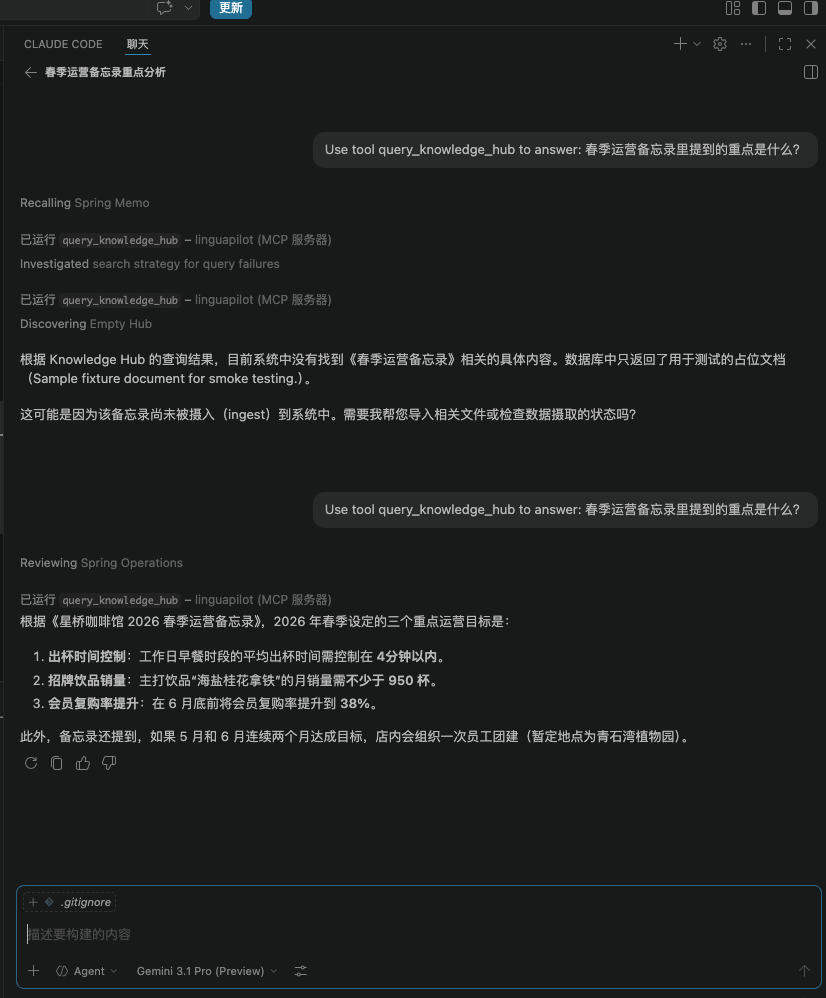
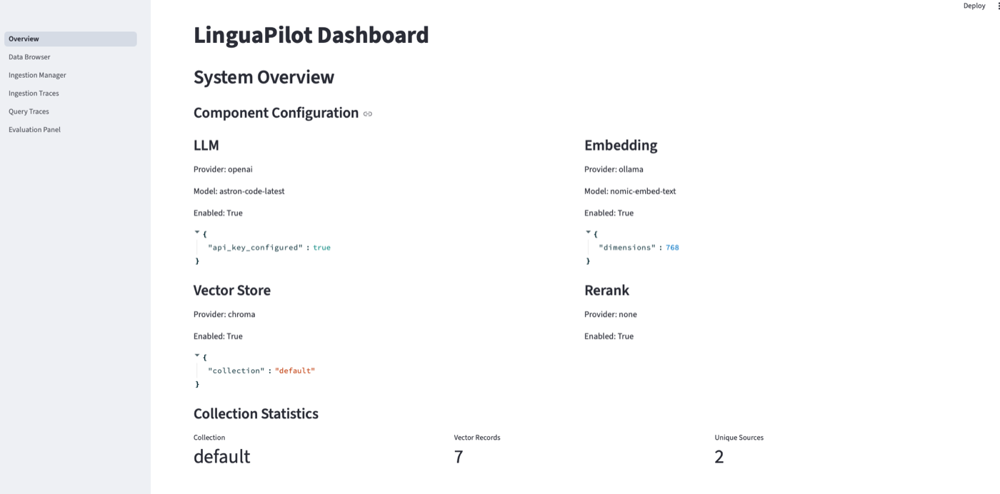
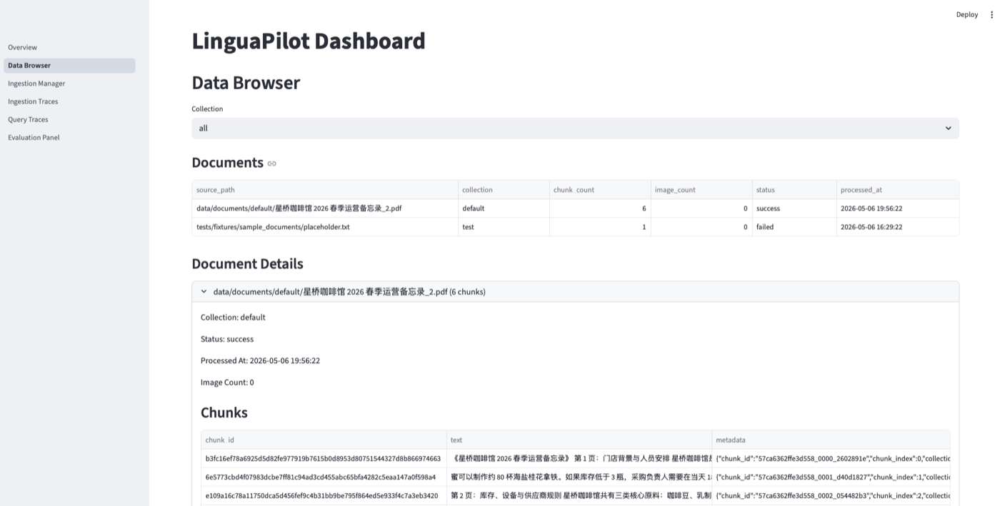
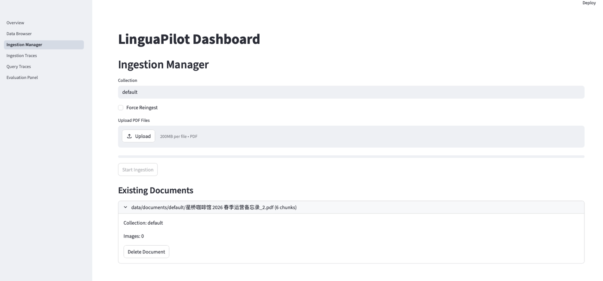
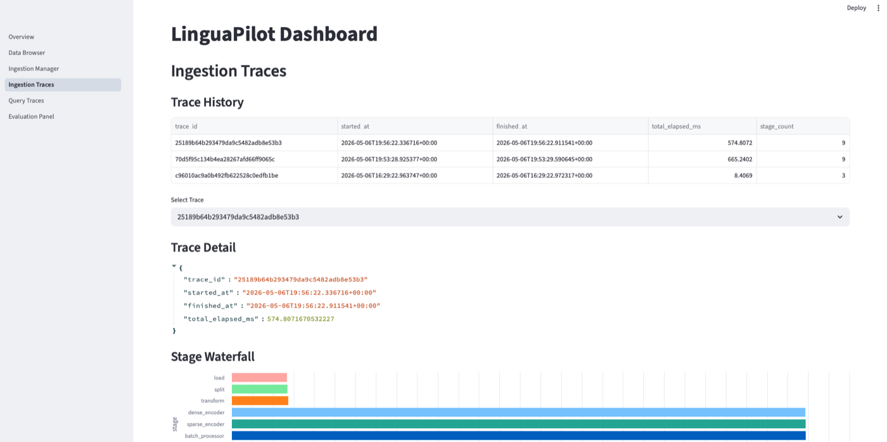
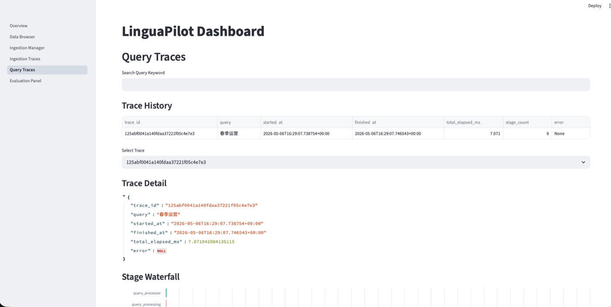

# Intern Onboarding Plan: RAG & MCP Infrastructure (4 Weeks)

## Week 1: Introduction to RAG and Vector Embeddings

**Learning Objective:** Understand the core mechanism of Retrieval-Augmented Generation (RAG) and how text is mathematically represented and matched using vector embeddings.
**Recommended Resource:** [Retrieval-Augmented Generation (RAG) Explained in 10 Minutes (IBM Technology)](https://www.youtube.com/watch?v=99SYeGK1OcE)

**Assignment: The Mathematics of Retrieval**
Develop a foundational Python script to perform vectorization and similarity matching without relying on high-level RAG frameworks (e.g., LangChain/LlamaIndex).

1. Select a short English story and manually divide it into 5 distinct text segments.
2. Utilize the OpenAI API or an open-source library (such as `SentenceTransformers`) to convert these 5 text segments into vector embeddings.
3. Define a query string (a question related to the content of the story).
4. Implement a cosine similarity calculation (using `NumPy` or `SciPy`) to determine the similarity score between the query vector and each of the 5 segment vectors.
5. Programmatically output the text segment that yields the highest similarity score.

---

## Week 2: Text Chunking Strategies and ChromaDB

**Learning Objective:** Analyze the impact of text chunking strategies on structured educational materials and implement local vector storage for data retrieval.
**Recommended Resource:** [What is RAG? RAG Project Series Part 1](https://www.youtube.com/watch?v=I_lARMJrRyU)

**Assignment: Processing Grammar Rules**
Implement a PDF ingestion pipeline and evaluate chunking quality on structured language text.

1. Download a public domain or open-source English grammar textbook (PDF format).
2. Write a Python script to extract the text and apply a basic, fixed-character-length chunking strategy.
3. **Core Task:** Output the generated chunks and conduct a manual review to identify structural failures. Document specific instances where the rigid chunking disrupts semantic units (e.g., splitting a conversational dialogue in half, or fracturing a verb conjugation table).
4. Initialize a local ChromaDB instance, store the generated text chunks, and perform a basic vector/keyword retrieval to fetch specific grammar rules.

---

## Week 3: Model Context Protocol (MCP) Implementation

**Learning Objective:** Understand the Model Context Protocol (MCP) standard and learn how to expose native Python functions as callable tools for Large Language Models.
**Recommended Resource:** [Intro to MCP Servers – Model Context Protocol with Python Course](https://www.youtube.com/watch?v=DosHnyq78xY)

**Assignment: Developing a Custom AI Tool**
Develop a localized MCP server exposing a language-focused utility.

1. Utilize a framework (such as the `fastmcp` library) to construct a basic MCP Server.
2. Define and register a specific Tool: Create a Python function that accepts an English base verb as an input parameter and returns its standard tense variations (past, present, future).
3. Run the MCP server locally.
4. Construct a lightweight client script (or connect via a compatible application like Claude Desktop) to verify that an LLM can successfully discover, call, and execute this custom tool based on a user prompt.

---

## Week 4: Integration - Building an AI Language Tutor Prototype

**Learning Objective:** Integrate retrieval, vector storage, and tool execution into a cohesive application, utilizing system prompts to simulate an educational AI persona.
**Recommended Resource:** [MCP Agentic AI Crash Course With Python](https://www.youtube.com/watch?v=MDBG2MOp4Go)

**Assignment: The Pedagogical Loop**
Construct a complete, micro-RAG pipeline tailored for language tutoring.

1. Develop a unified Python script that connects the ChromaDB instance from Week 2 with an LLM API.
2. Define a robust System Prompt, explicitly instructing the LLM to adopt the persona of a "highly patient and pedagogical foreign language tutor."
3. Implement the interaction loop: When a user submits a grammar-related query, the script must first execute a retrieval step against ChromaDB to extract the most relevant textbook context.
4. Pass both the user query and the retrieved context to the LLM. Ensure the final generated response relies explicitly on the retrieved data to formulate a guided, educational answer.

---

## Feature Overview

**1. MCP Q&A**  
Use the `query_knowledge_hub` tool in one sentence to query the knowledge base and get a concise answer.  

**2. System Overview**  
View LLM, embedding, vector store, and rerank settings in one place, along with collection statistics.  

**3. Data Browser**  
Browse documents by collection, including chunk and processing status, to quickly verify data quality.  

**4. Ingestion Manager**  
Upload PDFs and run ingestion with collection-based management and document deletion support.  

**5. Ingestion Traces**  
Inspect stage timings and execution details for ingestion jobs to identify bottlenecks.  

**6. Query Traces**  
Track the full query pipeline, including retrieval and fusion stages, for debugging and tuning.  

